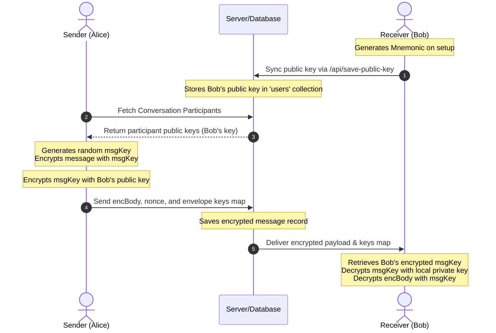

# End-to-End Encryption (E2EE) System Documentation

This project implements a robust End-to-End Encryption (E2EE) system using **BIP39 mnemonics** for key derivation and **libsodium** for cryptographic operations. This ensures that only the intended recipients can read the message content, as the server never sees the plaintext body or the private keys.

---

## 1. Technology Stack
- **Library**: `libsodium-wrappers` (High-level cryptographic library)
- **Key Derivation**: `bip39` (Generates 24-word recovery phrases)
- **Polyfills**: `buffer` (Required for BIP39 in browser environments)

---

## 2. Key Management Logic

### Generation and Derivation
The system derives a cryptographic keypair from a 24-word mnemonic. 

**Code: `resources/js/encrypt.js`**
```javascript
async deriveKeyPair(mnemonic) { 
    await this.init();
    const seed = bip39.mnemonicToSeedSync(mnemonic);
    const seed32 = seed.slice(0, 32); // Use first 32 bytes
    const keyPair = this.sodium.crypto_box_seed_keypair(seed32);
    
    return {
        publicKey: this.sodium.to_base64(keyPair.publicKey),
        privateKey: this.sodium.to_base64(keyPair.privateKey)
    };
}
```

### Storage and Security
- **Mnemonic**: Stored in `localStorage` as `e2e_recovery_{userId}`.
- **Keys**: Derived public/private keys live only in `sessionStorage` during the active session.
- **Cleanup (Logout)**: When a user logs out, all sensitive storage is purged.

**Code: `resources/js/app.js`**
```javascript
window.addEventListener('logout', () => {
    const userId = window.userId;
    if (userId) {
        localStorage.removeItem('e2e_recovery_' + userId);
        sessionStorage.removeItem('e2e_private_' + userId);
        sessionStorage.removeItem('e2e_public_' + userId);
    }
    // Scrub all E2E keys to prevent cross-account leakage
    for (let i = 0; i < localStorage.length; i++) {
        const key = localStorage.key(i);
        if (key.startsWith('e2e_recovery_')) localStorage.removeItem(key);
    }
});
```

---

## 3. Encryption Flow (Sending)

When the user clicks send, the `encryptAndSend` function in the Blade file orchestrates the encryption before sending data to the server.

**Code: `resources/views/livewire/messenger.blade.php`**
```javascript
async encryptAndSend() {
    const body = this.localBody;
    const userId = @js((string) auth()->id());
    let keys = @js($selected->participant_public_keys ?? []);
    let privateKey = sessionStorage.getItem('e2e_private_' + userId);

    // ... key recovery logic ...

    if (canEncrypt) {
        // 1. Encrypt body and wrap keys for recipients
        const result = await window.EncryptionService.encryptMessage(body, keys, privateKey);
        
        // 2. Send only encrypted data to Livewire/Server
        await $wire.messageUser(result.encBody, result.nonce, result.keys);
        this.localBody = '';
    }
}
```

**Code: `resources/js/encrypt.js` (The Engine)**
```javascript
async encryptMessage(body, recipientPublicKeys, senderPrivateKeyBase64) {
    const msgKey = this.sodium.randombytes_buf(this.sodium.crypto_secretbox_KEYBYTES);
    const nonce = this.sodium.randombytes_buf(this.sodium.crypto_secretbox_NONCEBYTES);
    
    // Encrypt the body with the symmetric msgKey
    const encBody = this.sodium.crypto_secretbox_easy(body, nonce, msgKey);
    
    // Wrap (Encrypt) the msgKey for each recipient using their Public Key
    const encryptedKeys = {};
    for (const [userId, publicKeyBase64] of Object.entries(recipientPublicKeys)) {
        const publicKey = this.sodium.from_base64(publicKeyBase64);
        const encKey = this.sodium.crypto_box_seal(msgKey, publicKey);
        encryptedKeys[userId] = this.sodium.to_base64(encKey);
    }

    return { encBody: this.sodium.to_base64(encBody), nonce: this.sodium.to_base64(nonce), keys: encryptedKeys };
}
```

---

## 4. Decryption Flow (Receiving)

Messages are decrypted locally in the browser. The server only sees the `encBody` and `metadata`.

**Code: `resources/js/encrypt.js`**
```javascript
async decryptMessageForMe(encBody, metadata, userId) {
    const privateKey = sessionStorage.getItem('e2e_private_' + userId);
    const encKeyForMe = metadata.enc_keys?.[userId];
    const nonce = metadata.nonce;

    // 1. Use Private Key to decrypt the symmetric 'msgKey'
    const msgKey = this.sodium.crypto_box_seal_open(encKeyForMe, myPublicKey, myPrivateKey);
    
    // 2. Use 'msgKey' and 'nonce' to decrypt the actual message body
    const decryptedBody = this.sodium.crypto_secretbox_open_easy(encBody, nonce, msgKey);
    
    return this.sodium.to_string(decryptedBody);
}
```

---

## 5. Security Highlights
- **Zero-Knowledge**: The server stores only base64 encrypted blobs. It cannot derive the symmetric key because it lacks the users' private keys.
- **Forced Re-Auth**: Login routes use `prompt=select_account` to ensure users can switch accounts without auto-logging into the previous session.
- **Storage Isolation**: Keys are explicitly tied to `userId` in storage to prevent accidental decryption if storage isn't cleared.
- **Automatic Scrubbing**: Any logout action triggers a browser event that purges all E2E keys from `localStorage` and `sessionStorage`.

---

## 6. Key Synchronization & Message Exchange

To enable E2E communication, users must exchange public keys securely. The workflow below describes how keys are synchronized and shared:



### 6.1 Public Key Registration (Alice/Bob Setup)
On initial login or recovery, the client derives its key pair from the mnemonic. If the server does not yet store the public key for the user, the client automatically uploads it via:
1. The Livewire component's `savePublicKey` action in [messenger.blade.php](file:///home/ninonakano/Desktop/SanCo/resources/views/livewire/messenger.blade.php).
2. The `/api/save-public-key` fallback endpoint in [routes/web.php](file:///home/ninonakano/Desktop/SanCo/routes/web.php).

Once uploaded, the public key is persisted on the user's document in the Database (`users` collection).

### 6.2 Key Retreival & Symmetric Envelope Wrapping (Sending)
When Alice writes a message to Bob in a shared conversation:
1. The client retrieves the public keys of all conversation participants (`participant_public_keys`).
2. The client generates a random, message-specific symmetric key (`msgKey`) using `libsodium`.
3. The message body is encrypted symmetrically with `msgKey`.
4. The `msgKey` is encrypted (sealed) individually for each participant using their respective public keys:
   $$\text{enc\_keys}[\text{userId}] = \text{sodium.crypto\_box\_seal}(\text{msgKey}, \text{publicKey}_{\text{userId}})$$
5. The payload containing the encrypted body (`encBody`), the initialization vector (`nonce`), and the map of encrypted symmetric keys (`keys`) is dispatched to the server.

### 6.3 Localized Envelope Unwrapping (Receiving)
When Bob receives the message from the server:
1. The client checks `sessionStorage` for the user's private key.
2. The client extracts Bob's specific encrypted key envelope from the message metadata:
   $$\text{encKeyForMe} = \text{metadata.enc\_keys}[\text{Bob's userId}]$$
3. Bob's private key opens (unseals) the envelope to retrieve the raw symmetric `msgKey`:
   $$\text{msgKey} = \text{sodium.crypto\_box\_seal\_open}(\text{encKeyForMe}, \text{Bob's publicKey}, \text{Bob's privateKey})$$
4. The client uses the recovered `msgKey` and `nonce` to decrypt the raw message body locally. Plaintext is never exposed to the server.

