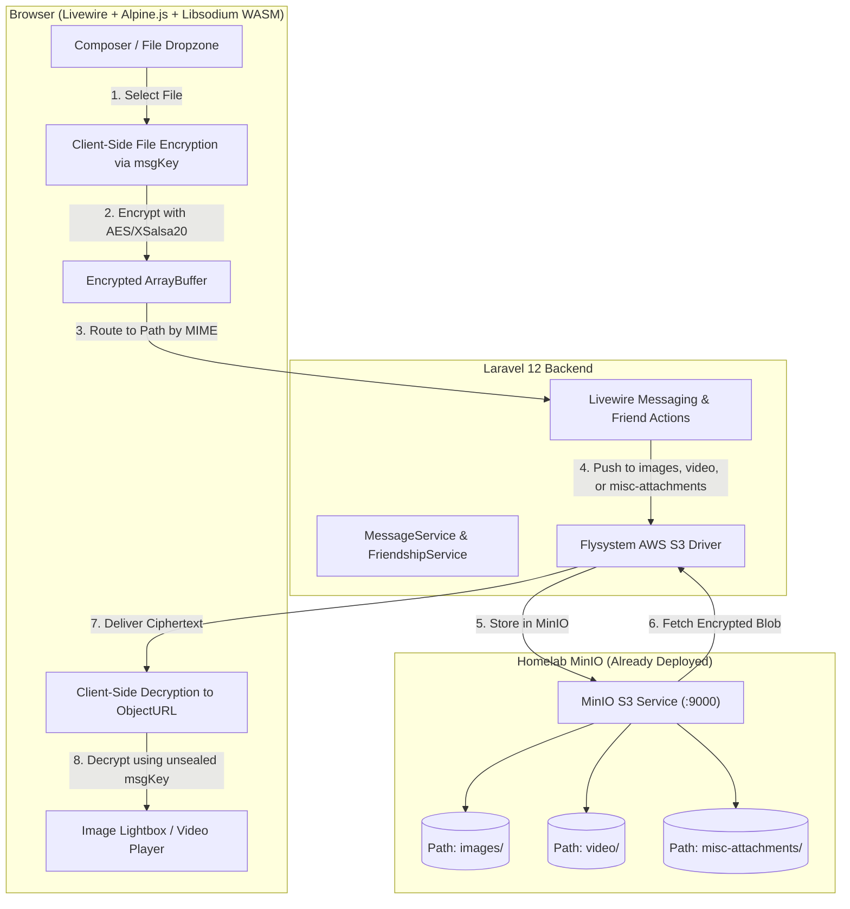

# Implementation Plan: Contact Blocking, E2EE Attachments/Video & Homelab MinIO Integration

## Goal Description
This plan provides the complete technical design and implementation steps for:
1. **Full Contact Blocking & Management**: Backend messaging enforcement and a dedicated UI for managing and unblocking contacts.
2. **End-to-End Encrypted (E2EE) Attachments & Video Streaming**: Client-side encryption/decryption of images, videos, audio, and documents with interactive media players and progress tracking.
3. **Homelab MinIO Storage Connection**: Connecting Laravel to the already-deployed MinIO instance on your homelab across three pre-configured paths: `images`, `video`, and `misc-attachments`.

---

## Architecture Overview



---

## User Review Required

> [!IMPORTANT]
> **Zero-Knowledge Attachment Encryption**: Files (images, videos, documents) are encrypted **client-side in the browser** before uploading to MinIO. MinIO and the server only ever store opaque binary ciphertext blobs (`application/octet-stream`).

> [!TIP]
> **Bucket Path Mapping**:
> - Images (`image/*`) → stored under `images/{hash}`
> - Videos (`video/*`) → stored under `video/{hash}`
> - Other Attachments (audio, pdf, docx, zip) → stored under `misc-attachments/{hash}`

---

## Part 1: Connecting to Already-Deployed Homelab MinIO

### 1.1 Laravel Package & Driver Setup
Install the AWS S3 Flysystem adapter for Laravel 12:
```bash
composer require league/flysystem-aws-s3-v3
```

### 1.2 Storage Configuration (`config/filesystems.php`)
```php
'minio' => [
    'driver' => 's3',
    'key' => env('AWS_ACCESS_KEY_ID'),
    'secret' => env('AWS_SECRET_ACCESS_KEY'),
    'region' => env('AWS_DEFAULT_REGION', 'us-east-1'),
    'bucket' => env('AWS_BUCKET'),
    'url' => env('AWS_URL'),
    'endpoint' => env('AWS_ENDPOINT'),
    'use_path_style_endpoint' => env('AWS_USE_PATH_STYLE_ENDPOINT', true),
    'throw' => true,
],
```

### 1.3 Environment Configuration (`.env`)
Configure your `.env` with your homelab MinIO server IP/hostname and credentials:

```env
# Filesystem Storage Configuration
FILESYSTEM_DISK=minio

# MinIO S3 Credentials (Homelab)
AWS_ACCESS_KEY_ID=minioadmin
AWS_SECRET_ACCESS_KEY=YourMinioPassword
AWS_DEFAULT_REGION=us-east-1
AWS_BUCKET=sanco
AWS_ENDPOINT=http://192.168.1.100:9000
AWS_USE_PATH_STYLE_ENDPOINT=true
AWS_URL="${AWS_ENDPOINT}/${AWS_BUCKET}"

# Bucket Path Prefixes
AWS_PATH_IMAGES="images"
AWS_PATH_VIDEOS="video"
AWS_PATH_ATTACHMENTS="misc-attachments"
```

---

## Part 2: Contact Blocking Implementation

### 2.1 Backend Logic & Messaging Enforcement
- **Block Check in `MessageService`**: Prevent creating/broadcasting messages if sender or recipient is in the other party's blocked list (`isBlocked`).
- **Cache Invalidation**: On block/unblock, immediately invalidate `sanco:user:{id}:blocks`, `sanco:user:{id}:friends`, and `sanco:user:{id}:inbox`.
- **Query Helper**: Add `getBlockedUsers(string $userId)` to `FriendshipService` to retrieve all blocked user documents.

### 2.2 Livewire Trait & UI Extensions
- **`FriendActions.php`**:
  - Add `$blockedContacts` computed property.
  - Enhance `blockUser(string $friendId)` with instant UI notification and conversation reset.
  - Implement `unblockUser(string $friendId)` to restore mutual neutrality or friendship.
- **`settings-overlay.blade.php`**:
  - Add a **"Blocked Contacts"** tab in Settings.
  - Render list of blocked users with user tag, avatar, and an active **"Unblock"** button.
- **`messenger.blade.php`**:
  - Show warning banner in chat canvas when viewing a blocked contact: *"You have blocked this contact. Unblock them to send and receive messages."*
  - Disable composer input when blocked.

---

## Part 3: E2EE Media & Video Attachments

### 3.1 Client-Side Encryption Workflow (`resources/js/encrypt.js`)
1. User selects an image/video/file in the chat composer.
2. The browser generates a random 256-bit symmetric key (`msgKey`) and 24-byte nonce.
3. The file data is encrypted into an encrypted `Uint8Array` binary blob.
4. The client computes thumbnail/dimensions/duration (for videos/images) and packages them into the encrypted envelope.
5. The encrypted payload is uploaded to Laravel and stored in the corresponding MinIO path (`images/`, `video/`, or `misc-attachments/`).

### 3.2 UI Components & Chat Composer
- **Composer Attachment Bar**:
  - Clip icon triggering file selector with drag-and-drop support.
  - Preview chip before sending with remove button and upload progress bar.
- **Message Bubble Media Renderer**:
  - **Images**: Responsive image with loading skeleton, click-to-expand modal/lightbox, and download option.
  - **Videos**: HTML5 `<video controls playsinline>` with play button, progress bar, fullscreen toggle, and decrypted streaming buffer.
  - **Audio**: Custom waveform/audio player with duration display.
  - **Files / Documents**: File badge with name, size, and direct decrypt-and-save button.

---

## Proposed Changes Grouped by Component

### Component 1: Storage Configuration & S3 Driver
- [MODIFY] `composer.json` — Add `league/flysystem-aws-s3-v3`
- [MODIFY] `config/filesystems.php` — Add `minio` disk configuration
- [MODIFY] `.env.example` — Added MinIO credentials and folder paths (`images`, `video`, `misc-attachments`)

### Component 2: Contact Blocking System
- [MODIFY] `app/Services/FriendshipService.php` — Add `getBlockedUsers(string $userId)`
- [MODIFY] `app/Services/MessageService.php` — Enforce block checks before saving/broadcasting
- [MODIFY] `app/Livewire/MessengerVolt/FriendActions.php` — Add blocked contacts list and refresh handlers
- [MODIFY] `resources/views/livewire/messenger/settings-overlay.blade.php` — Add "Blocked Users" section with Unblock buttons
- [MODIFY] `resources/views/livewire/messenger.blade.php` — Display blocked status banner and block controls

### Component 3: E2EE Media & Video Attachments
- [MODIFY] `app/Models/Attachment.php` — Add encryption metadata casts and path routers (`images/`, `video/`, `misc-attachments/`)
- [MODIFY] `app/Services/MessageService.php` — Support attachment arrays in `send()`
- [MODIFY] `app/Livewire/MessengerVolt/MessagingActions.php` — Handle Livewire file upload and attachment payloads
- [MODIFY] `resources/js/encrypt.js` — Implement binary blob encryption & decryption methods
- [MODIFY] `resources/views/livewire/messenger.blade.php` — Add file attachment picker, upload progress, image lightbox, and HTML5 video player

---

## Verification Plan

### Automated Tests
1. `tests/Feature/FriendshipBlockTest.php`:
   - Verify `blockUser()` updates MongoDB status and purges cache.
   - Verify `unblockUser()` clears block status.
   - Verify `MessageService::send()` throws `AuthorizationException` when messaging a blocked user.
2. `tests/Feature/AttachmentUploadTest.php`:
   - Verify file upload routing to `images/`, `video/`, and `misc-attachments/` on MinIO disk.
   - Verify attachment metadata serialization in `Message` embedded documents.

### Manual Verification
1. **MinIO Connectivity**: Run artisan storage test to upload and retrieve a sample blob from homelab MinIO.
2. **Contact Blocking**:
   - Block a user from the chat dropdown.
   - Confirm user appears in Settings -> Blocked Contacts.
   - Click "Unblock" and confirm conversation re-enables.
3. **E2EE Attachments**:
   - Attach an image and a video in chat.
   - Verify encrypted ciphertext is stored in `images/` and `video/` on MinIO.
   - Verify recipient decrypts and plays the video / renders the image smoothly.
